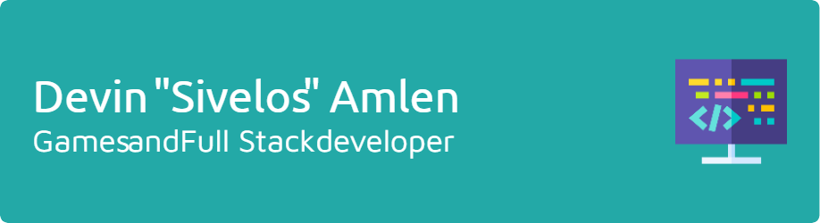

         

### Hey hey hey!

My name is Sivelos. I'm a developer who enjoys making games, web pages, and anything that helps me create cool stuff.

Check out some of my stuff!

<!--
**Sivelos1/Sivelos1** is a ✨ _special_ ✨ repository because its `README.md` (this file) appears on your GitHub profile.

Here are some ideas to get you started:

- 🔭 I’m currently working on ...
- 🌱 I’m currently learning ...
- 👯 I’m looking to collaborate on ...
- 🤔 I’m looking for help with ...
- 💬 Ask me about ...
- 📫 How to reach me: ...
- 😄 Pronouns: ...
- ⚡ Fun fact: ...
-->

Banner made by [leviarista's generator](https://leviarista.github.io/github-profile-header-generator/)!
